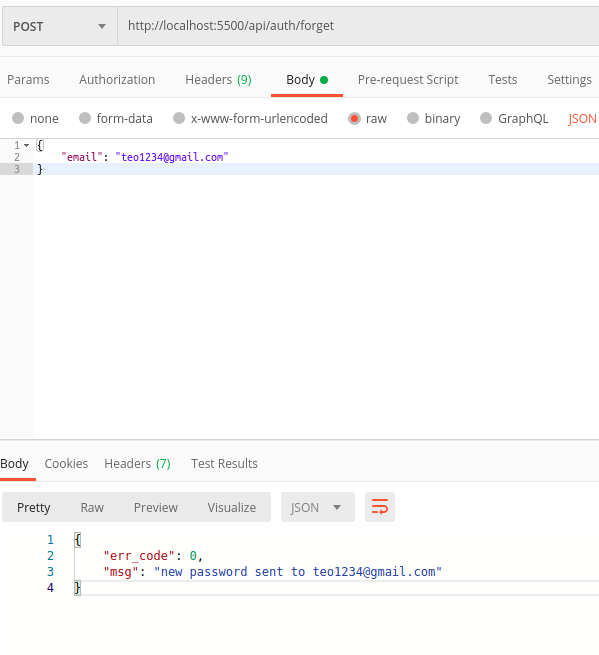

sau khi update code mới, đứng ở thư mục api_getway chạy cmd sau:

``` bash
node updatedb.js 
```

api quên mật khẩu `http://localhost:5500/api/auth/forget`



api chuyển tiền đã được fix

flow quên mật khẩu như sau:
1. submit email quên mât khẩu.
2. password mới được gửi về mail dùng password này để login.
3. đổi mật khẩu để sử dụng account.


`mở email node mailer để lấy mật khẩu, chú ý config mailer`